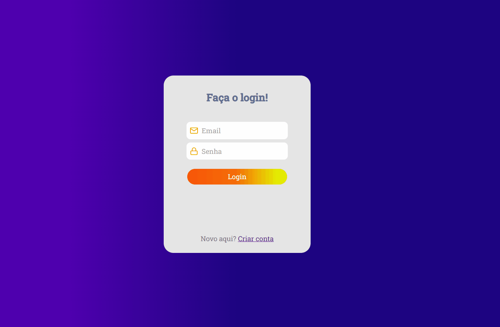

 <h1 align="center">Lista de cadastro de produtos com autenticação.</h1>

<p align="center">Esse projeto tem a autenticação guardada no cookies, permite o cadastro e edição de produtos, assim como a organização por preço, nome, data, etc. Tem o limite de 10 produtos por página!</p>

---

<div align="center" >
  
  
</div>

---

## 🚀 Technologies

⚙️ Principais tecnologias utilizadas:

- ✔️ReactJS

- ✔️NodeJS

- ✔️MongoDB

- ✔️Express

- ✔️Styled-Components

- ✔️JWT-token

- ✔️BcryptJs

- ✔️Redux

- ✔️Redux-Saga

- ✔️@unform

- ✔️React router dom

#

## Como executar o projeto

Para executar o projeto você precisa ter o [Node.js](https://nodejs.dev) e o [MongoDB](https://www.mongodb.com/try/download/community) instalados na sua maquina.

1. Clone esse repositório.

```
git clone https://github.com/isaaacwillian/Teste.git
```

2. Acesse a pasta do projeto.

3. Instale as dependências dentro de ambas pastas (backend, frontend) com o seguinte comando:

```
npm install
```

4. No backend, execute a aplicação com o seguinte comando:

```
npm start
```

5. Já no frontend, execute com esse comando:

```
npm run dev
```

#

Made with 💙 by Isaac Willian 👋 [See my linkedin](https://www.linkedin.com/in/isaaacwillian/)
